# RoomReservationNext

A modern, full-stack room reservation system built with Next.js 15, PostgreSQL, and Stripe integration.

## 🚀 Features

- **Room Management**: Search and view detailed information about available rooms.
- **Booking System**: Secure reservation process with Stripe payment integration.
- **Admin Dashboard**:
  - **User Management**: View and manage registered users.
  - **Room Management**: Add, edit, deactivate, or delete rooms.
  - **Calendar View**: Visual representation of all reservations.
  - **Reservation Management**: Track and manage all bookings.
- **Real-time Image Preview**: Upload and preview room images in the admin panel.
- **Email Notifications**: Automated email system for reservation status updates (Queued processing).
- **Responsive Design**: Fully optimized for mobile and desktop screens.

## 🛠️ Technologies Used

### Frontend

- **Framework**: Next.js 15 (App Router)
- **Styling**: Tailwind CSS
- **State Management**: React Context API
- **Fonts**: Geist (Vercel)

| | | |
| :---: | :---: | :---: |
| <kbd>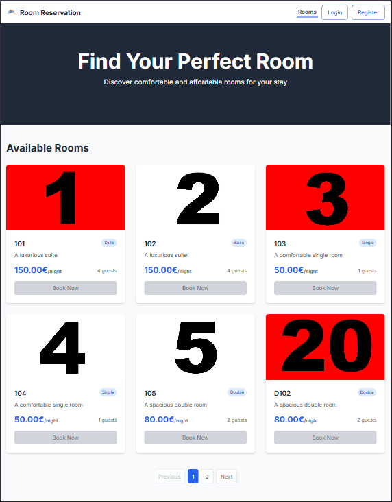</kbd> | <kbd>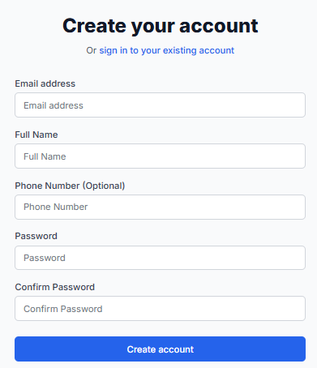</kbd> | <kbd>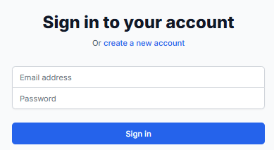</kbd> |
| <kbd>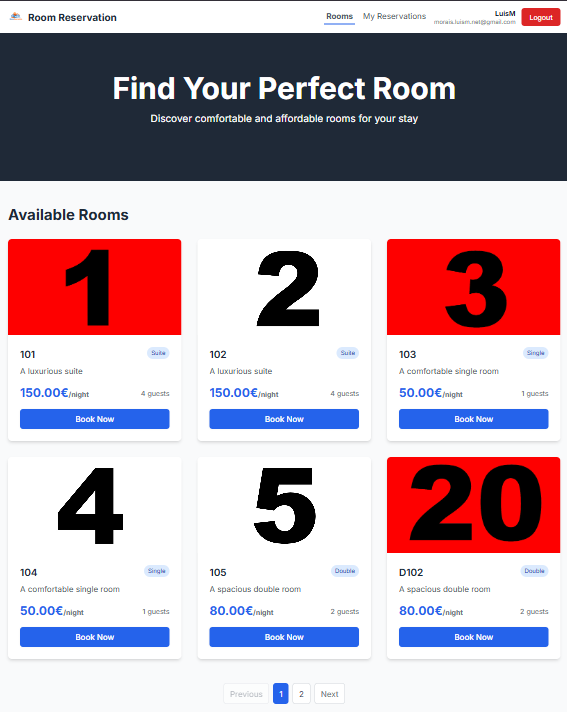</kbd> | <kbd>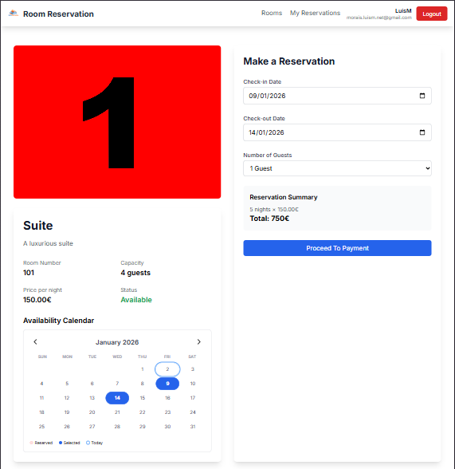</kbd> | <kbd>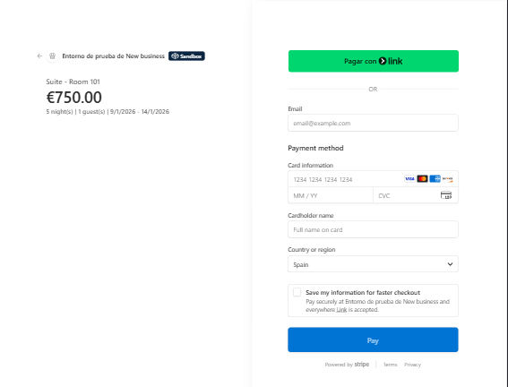</kbd> |
| <kbd>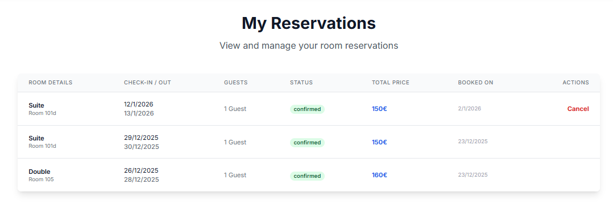</kbd> | <kbd>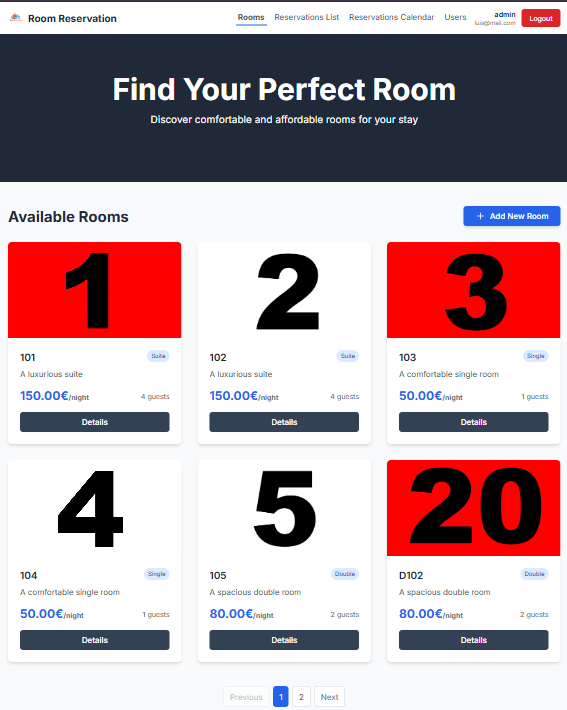</kbd> | <kbd>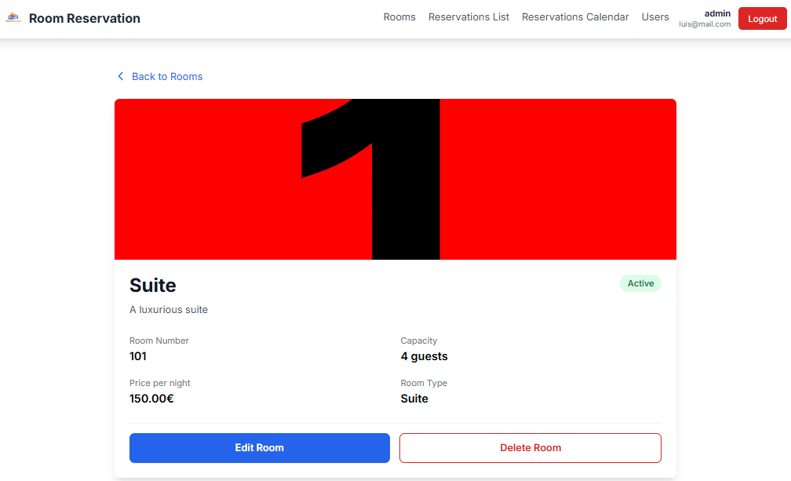</kbd> |
| <kbd>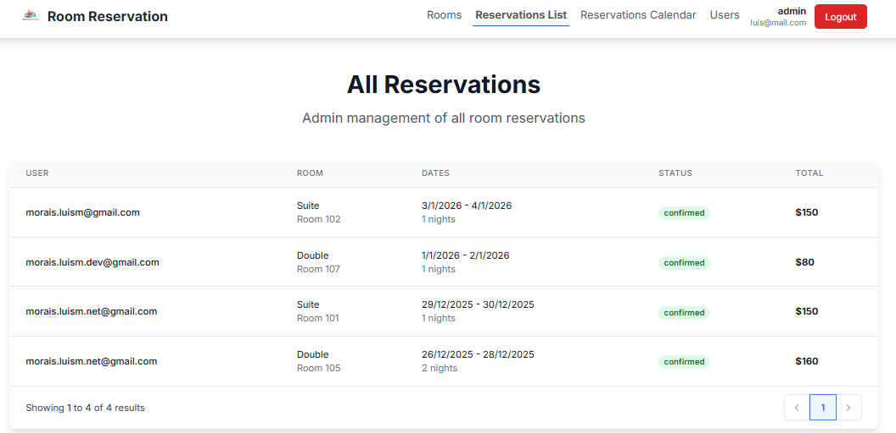</kbd> | <kbd>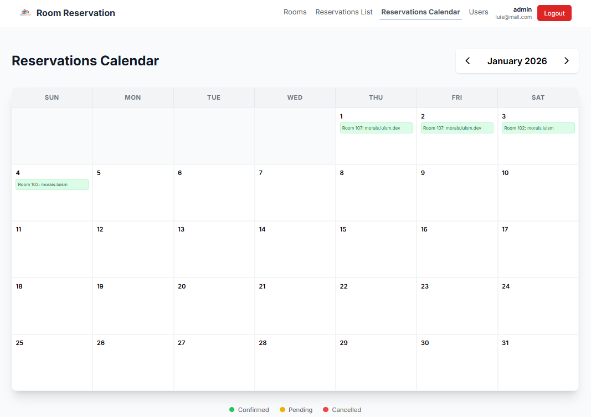</kbd> | <kbd>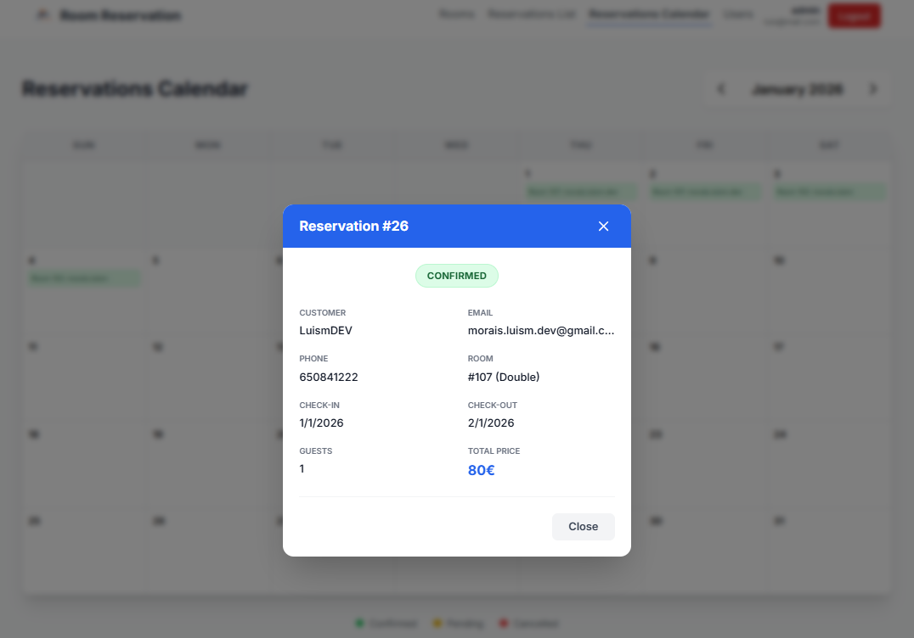</kbd> |
| <kbd>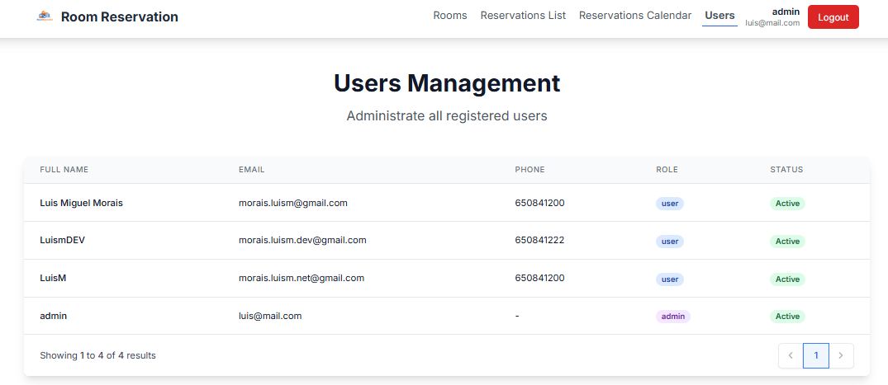</kbd> |

### Backend

- **Runtime**: Node.js
- **Database**: PostgreSQL
- **ORM**: TypeORM
- **Authentication**: JWT (JSON Web Tokens) with Bcrypt password hashing
- **Payments**: Stripe API
- **Emails**: Nodemailer with SMTP

## 📂 Folder Structure

```text
src/
├── app/              # Next.js App Router (Routes and API)
│   ├── (auth)/       # Authentication pages
│   ├── admin/        # Administrator dashboard
│   ├── api/          # Backend API endpoints
│   ├── payment/      # Payment success/cancel pages
│   └── rooms/        # Public room pages
├── components/       # Reusable UI components
├── context/          # Global state (AuthContext)
├── hooks/            # Custom React hooks
├── lib/              # Core logic and configuration
│   ├── config/       # Database and Stripe config
│   ├── entities/     # TypeORM Entities
│   └── utils/        # Helper functions
└── services/         # Business logic services
```

## 📋 Requirements

- **Node.js**: v18.0 or higher
- **PostgreSQL**: v14.0 or higher
- **Stripe Account**: For payment processing
- **SMTP Server**: For email notifications

## ⚙️ Installation and Execution

1. **Clone the repository**:

   ```bash
   git clone <repository-url>
   cd room-reservation-next
   ```

2. **Install dependencies**:

   ```bash
   npm install
   ```

3. **Configure Environment Variables**:
   Create a `.env` file in the root directory (refer to `.env.example` if available):

   ```env
   # Database
   DB_HOST=localhost
   DB_PORT=5432
   DB_USER=your_user
   DB_PASSWORD=your_password
   DB_NAME=room-reservation-db

   # JWT
   JWT_SECRET=your_jwt_secret
   JWT_EXPIRES_IN=24h

   # Stripe
   STRIPE_SECRET_KEY=sk_test_...
   NEXT_PUBLIC_STRIPE_PUBLISHABLE_KEY=pk_test_...

   # Email (SMTP)
   SMTP_HOST=smtp.example.com
   SMTP_PORT=587
   SMTP_USER=your_email@example.com
   SMTP_PASS=your_password
   SMTP_FROM=noreply@roomreservation.com
   ```

4. **Run the development server**:

   ```bash
   npm run dev
   ```

5. **Access the application**:
   Open [http://localhost:3000](http://localhost:3000) in your browser.

## 📡 API Endpoints

### Public Endpoints

- `GET /api/rooms` - Fetch all active rooms
- `GET /api/rooms/[id]` - Fetch details of a specific room
- `GET /api/room-types` - Fetch available room types

### Authentication

- `POST /api/auth/register` - Create a new user account
- `POST /api/auth/login` - Authenticate user and return JWT

### Admin (Requires Authorization)

- `GET /api/admin/users` - View all users
- `POST /api/admin/rooms` - Create a new room
- `PUT /api/admin/rooms/[id]` - update an existing room
- `DELETE /api/admin/rooms/[id]` - Remove a room
- `GET /api/admin/reservations` - View all system reservations

### Payments (Stripe)

- `POST /api/stripe/create-checkout-session` - Initialize payment
- `POST /api/stripe/verify-payment` - Confirm successful payment

## 💳 Stripe Integration

Payments are handled via Stripe Checkout. When a user books a room:

1. The system creates a session on Stripe.
2. The user is redirected to Stripe's secure payment page.
3. Upon success, the user returns to `/payment/success`.
4. The system verifies the payment server-side and confirms the reservation.

## 📧 Email Configuration

The system uses an asynchronous **Email Queue** to handle notifications:

- Reservation confirmation emails.
- Payment success notifications.
- Admin alerts for new bookings.

Ensure your SMTP credentials are correctly set in the `.env` file to enable this feature.

## 🔒 Security

- **Password Hashing**: Bcrypt is used to salt and hash passwords before storage.
- **JWT Authorization**: API routes and Admin pages are protected using JWT validation.
- **Role-Based Access**: Permission system limits sensitive actions to administrators.
- **Database Safety**: Parameterized queries via TypeORM prevent SQL injection.

## 💡 Example Use Case

1. **User Registration**: A guest creates an account via `/register`.
2. **Room Search**: Guest browses available rooms and selects dates.
3. **Checkout**: Guest clicks "Book Now" and is redirected to Stripe to pay.
4. **Confirmation**: After payment, the guest receives a confirmation email, and the admin sees the new booking on the **Calendar**.
5. **Management**: Admin can later edit room details or update reservation statuses.

[DeepWiki moraisLuismNet/RoomReservationNext](https://deepwiki.com/moraisLuismNet/RoomReservationNext)

deployed in:
https://room-reservation-next-git-main-luismnets-projects.vercel.app/
